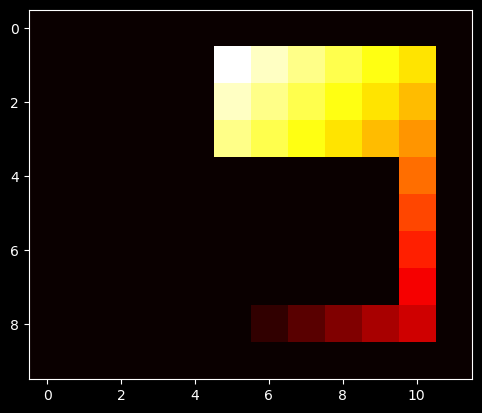
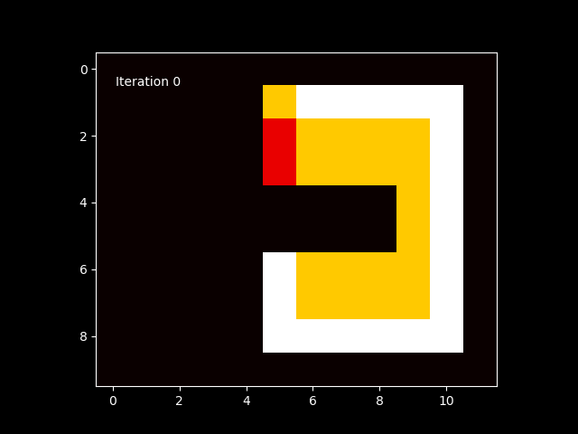
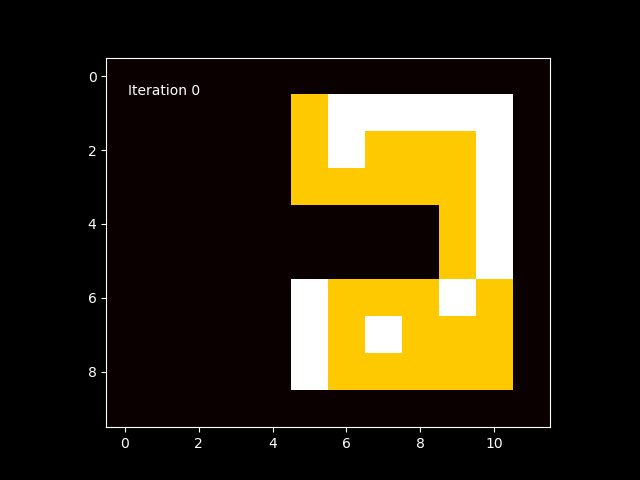

# Monte Carlo Methods & Policy Evaluation

This module explores **Monte Carlo (MC) methods** for Reinforcement Learning using a custom `RaceTrackEnv`. The goal is to teach an agent to navigate a U-Turn course, managing velocity and position to reach a finish line without crashing.

## **1. Policy Evaluation (Prediction)**
We began by evaluating a deterministic "Dummy Policy" that follows a fixed path (Right $\to$ Down $\to$ Left).
*   **Process:** Implemented **First-Visit Monte Carlo** prediction. The algorithm simulates full episodes, calculates the total return ($G_t$) backwards from the finish line, and updates the state values $V(s)$.
*   **Outcome:** The resulting value map perfectly represents the "steps-to-go" for every state along the path.

*Figure 1: Heatmap showing the value of states under the dummy policy. Darker regions represent states closer to the goal.*

## **2. On-Policy $\varepsilon$-Greedy Control**
We implemented a control algorithm to learn an optimal policy from scratch.
*   **Process:** Used an $\varepsilon$-greedy exploration strategy. To prevent infinite loops during the early random exploration phase, a step limit (e.g., 200 steps) was enforced.
*   **Outcome:** The agent learned to deviate from the rigid grid movement, adopting a "corner-cutting" trajectory to minimize the time to the goal.

*Figure 2: Animation of the agent learning over 500 episodes.*

*Figure 3: The final learned policy demonstrating optimized cornering.*
